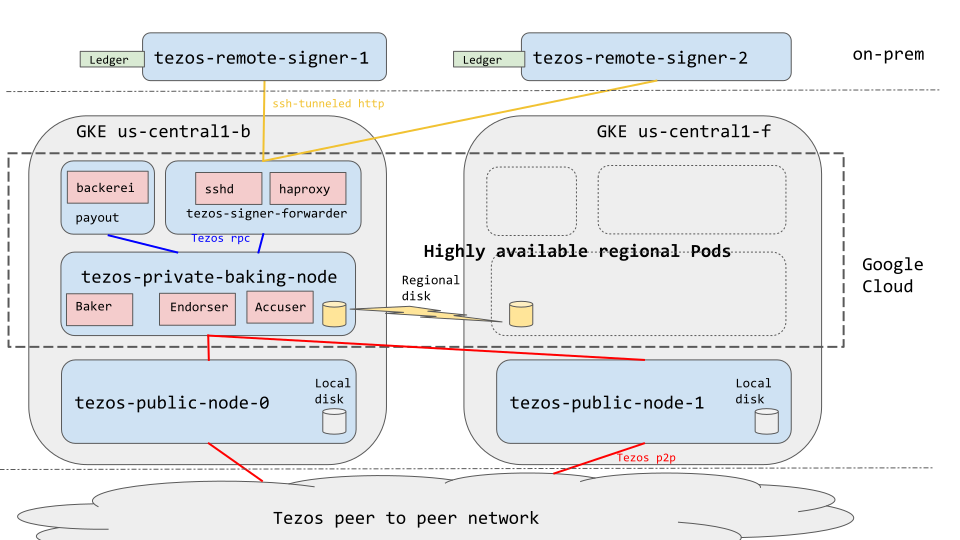

Tezos-on-GKE
============

[Tezos](http://tezos.gitlab.io/mainnet/) is a [delegated proof of stake](https://bitshares.org/technology/delegated-proof-of-stake-consensus/) blockchain protocol.

This deploys a fully featured, [best practices](https://medium.com/tezos/its-a-baker-s-life-for-me-c214971201e1) Tezos baking service on Google Kubernetes Engine.

This setup does not include the signer for the baking keys. These keys should be exposed by a remote signer connected to a Hardware Security Module under your control.

Features:

* high availaibility baking, endorsing and accusing
* ssh endpoint for remote signing
* compatible with mainnet and alphanet
* blockchain snapshot download and import from a public URL for faster synchronization of the nodes
* support for two highly available signers
* deploy everything in just one command
* TODO:
  * metric-based monitoring and alerting with prometheus

A reference deployment of this infrastructure is at [hodl.farm](https://hodl.farm).

Architecture
------------

This is a Kubernetes private cluster with two nodes located in two Google Cloud zones.

A StatefulSet of two public nodes is connected to the Tezos peer to peer network. As the cluster sits behind a NAT, the nodes initiate connections to public nodes, but are not discoverable.

A private Tezos baking node performs signing, endorsing and accusing. It synchronizes exclusively with the two public nodes belonging to the cluster.

An ssh endpoint is accessed by the remote signer (outside of GKE) to establish a tunnel to the signing daemon.

Instructions and code to set up the remote signers are at https://github.com/hodl-dot-farm/tezos-remote-signer-os

Optionally, you can set up a secondary cluster to perform monitoring of the baking operations, delegate payout and baking website update. For a solo baking operation, payout and website are not needed. The source code for the auxiliary cluster is at https://github.com/hodl-dot-farm/tezos-auxiliary-cluster




High availability
-----------------

Google guarantees 99.99% SLA on a highly available cluster provided that the Kubernetes deployment itself is highly available. We are using different means to this end.

The StatefulSet ensures that each public Tezos node is running in a different cluster node, so a zone failure does not affect functionality.

The private Tezos Node must not run in two locations at once, lest you are at risk of double baking and getting your funds slashed. Instead of a StatefulSet, a highly available pod backed by a [Regional Persistent Disk](https://cloud.google.com/compute/docs/disks/#repds) is used. In case of a Google Zone maintenance or failure, the baking pod is restarted in the other zone in an already synchronized state.

It is recommended that the signer have a redundant power supply as well as battery backup. It should also have redundant access to the internet. It should be kept in a location with physical access control as any disconnection event on the Ledger wallet will require entering the PIN.

Cost
----

With the default variables, the setup runs in two n1-standard-2 VMs on GCP platform, and uses SSDs as storage. The cost per month is approximately 150 USD. There are a few options to reduce the costs:

* Switch to two n1-standard-1 VMs. It is enough once the blockchain is synchronized, however for initial synchronization larger VMs tend to help. Kubernetes allow you to perform this change without downtime.
* Switch to magnetic drives instead of SSDs

Dependencies
------------

1. Download and install [Terraform](https://terraform.io)

1. Download, install, and configure the [Google Cloud SDK](https://cloud.google.com/sdk/). You will need
   to configure your default application credentials so Terraform can run. It
   will run against your default project, but all resources are created in the
   (new) project that it creates.

1. Install the [kubernetes
   CLI](https://kubernetes.io/docs/tasks/tools/install-kubectl/) (aka
   `kubectl`)

1. install and configure docker


Prepare archie and snapshot
----------------------------

You need to provide the url where to download an archive and a snapshot in order to bootstrap your baker.

To generate a snapshot, simply follow the instructions in `tezos-node snapshot export --help`

To generate an archive in lz4 format, sync a full node in archive mode, then do:

```
cd ~/.tezos-node
tar cvf - context store |  lz4 > mainnet.archive.tar.lz4
```

How to deploy
-------------

You need a Google Cloud Organization. You will be able to create one as an individual by registering a domain name.

You need to use a gcloud account as a user that has permission to create new projects. See [instructions for Terraform service account creation](https://cloud.google.com/community/tutorials/managing-gcp-projects-with-terraform) from Google.

1. Collect the necessary information and put it in `terraform.tfvars`

1. Run the following:

```
cd terraform

# The next 6 lines are only necessary if you are using a terraform service account.
# Alternatively, create a project manually and pass it as parameter.
export TF_VAR_org_id=YOUR_ORG_ID
export TF_VAR_billing_account=YOUR_BILLING_ACCOUNT_ID
export TF_ADMIN=${USER}-terraform-admin
export TF_CREDS=~/.config/gcloud/${USER}-terraform-admin.json
export GOOGLE_APPLICATION_CREDENTIALS=${TF_CREDS}
export GOOGLE_PROJECT=${TF_ADMIN}

terraform init
terraform plan -out plan.out
terraform apply plan.out
```

This will take time as it will:
* create a Google Cloud project
* create a Kubernetes cluster
* build the necessary containers locally
* spin up the public nodes and private baker nodes

Then set up the signers and have them connect to the public endpoint.

Apply an update
---------------

If you have pulled the most recent version of `tezos-on-gke` and wish to apply updates, you may do so with a `terraform taint`:

```
terraform taint null_resource.push_containers && terraform taint null_resource.apply && terraform plan -out plan.out
terraform apply plan.out
```

This will rebuild the containers locally, then do a `kubectl apply` to push the most recent changes to your cluster.

The daemons will restart after some time. However, you may kill the pods to restart them immediately.

Protocol update
---------------

When the Tezos protocol changes, be sure to edit the terraform variables `protocol` and `protocol_short` to match the new version.

On your machine, issue `docker pull tezos/tezos:mainnet` to ensure you have the latest version of the baker and endorser.

Then, apply the changes. Your baker will restart with the right baking and endorsing daemons.

Remotely ssh into the remote signers
------------------------------------

For remote connectivity and debugging purposes, ssh port 22 for the on-prem remote signers is being forwarded on ports 9443 and 9444.

To connect to the signers, forward port 9443/9444 from the `tezos-remote-signer-forwarder` locally, then ssh to localhost using your private key associated with the public key injected into the baker during initial setup.

Security considerations
-----------------------

The main security risk of this setup is operator error. It is recommended to stage any new deployment of this code to an alphanet cluster before rolling it out against actual funds.

Another risk is related to the avaialability of the signer.

The baking keys can not be kept in a cold storage address, since a message must be signed for each endorsment. But they must be protected by some sort of hardware bastion, so if an attacker gains access to any part of the setup, they may not walk away with the keys. In this simple setup, we used a Ledger Nano. Larger operations may use a cloud HSM.

The Ledger Nano baking app is deliberately separate from the regular Tezos app, so it can not be used to send payouts to delegators. The payouts should be sent from another address, which is kept in a hot wallet. It is discouraged to automate replenishing the payout address from the baking address, as this would require the baking address to be kept in a hot wallet.

There are also risks inherent with using GCP, such as loosing access to your credentials, getting hacked, or getting your account terminated by your provider.
